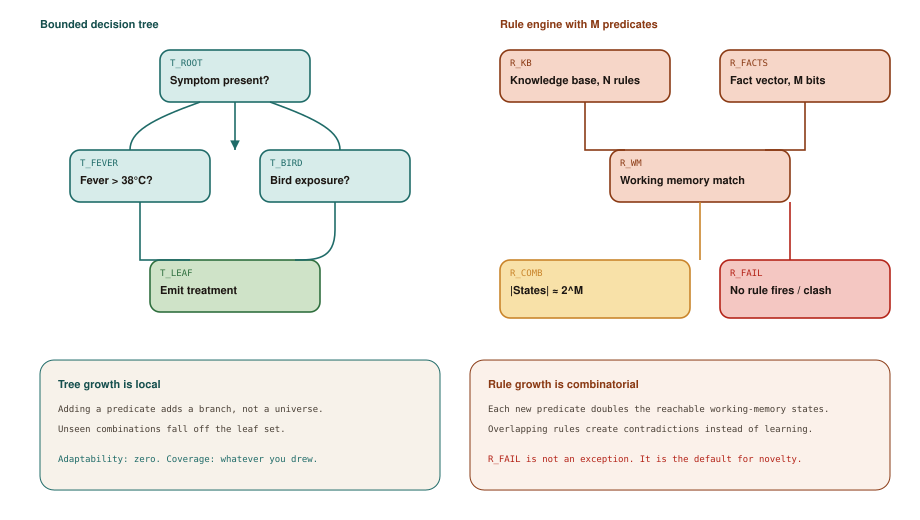

# The Pattern Matchers

## Chapter art: The Oracle That Could Not Shrug

### Panel 1 — Alex
*Hospital basement, 1987. A green terminal, a proud intern.*

> The doctors already know this. We just type their rules into the computer. Instant intelligence.

Alex meets an expert system — a program made of if-then rules — and wants to extend it over the weekend.

### Panel 2 — System
*A patient shows up with a mix of symptoms nobody wrote a rule for.*

> NO RULE FIRED.

The world is full of leftovers. A checklist cannot shrug. It either matches, or it goes quiet.

### Panel 3 — Alex
*Two weeks later. Forty new rules. Two of them disagree.*

> If we just add one more if-statement…

Every patch feels reasonable. The pile of rules is getting harder to trust.

### Panel 4 — Elena
*Whiteboard. A cloud labeled 2^M. Elena puts the marker down.*

> You did not encode judgment. You encoded last quarter's checklist.

Old “AI” could be inspected. It could not adapt.

## Socratic dialogue: Why can't we just add another if?

**Alex:** If-then rules are readable. If something is missing, we add a branch. That's just maintenance.

**Elena:** A decision tree is honest: you can see the holes. A giant rulebook pretends to be a mind. Look at Diagram 1.1. On the left, T_LEAF is a destination — you arrive, or you don't. On the right, R_COMB is a universe of combinations.

**Alex:** So we write more rules until every combination is covered. That's what the experts are for.

**Elena:** Each extra yes/no fact roughly *doubles* the number of situations the program might be in. You will not hire your way through doubling. And the next surprise still lands in R_FAIL: no rule matches, or two rules fight.

**In other words:** A small flowchart is honest about holes. A giant rulebook explodes as you add facts — and surprises still fall through.

## Diagram 1.1

**Read the picture:** Left: a small flowchart you can finish. Right: a pile of rules that explodes as you add facts — and still fails on surprises.

1. **T_ROOT** — Start with one question.
2. **T_FEVER** — Yes/no branches stay local — add a question, add a branch.
3. **T_LEAF** — A matching case reaches an answer.
4. **R_KB** — Now the ambitious version: a big book of if-then rules.
5. **R_FACTS** — Each extra yes/no fact roughly doubles the situations.
6. **R_COMB** — That doubling is the explosion.
7. **R_FAIL** — A new mix of facts: nothing matches, or two rules fight.

## Technical deep-dive

For a long time, “AI” did not mean a chatbot. It meant **writing down** how a specialist decides, then freezing that into software.

A **decision tree** is the simple version: a flowchart of questions. A **rule engine** (sometimes called an expert system) is the ambitious version: a big pile of if-then rules that try to fire whenever the current facts match. Famous examples had names like MYCIN and DENDRAL. They were impressive because you could *read* them. They failed at being intelligent because reading is not the same as learning.

### Two pictures that get confused

On the left of Diagram 1.1, the path **T_ROOT → T_FEVER / T_BIRD → T_LEAF** is a small object. Add a question, add a branch. If a case does not match any drawn path, it never reaches T_LEAF. You can see the hole and file a ticket.

On the right, **R_KB** is the knowledge base (N rules) and **R_FACTS** is the list of true/false facts (M of them). They pour into **R_WM**, the matcher that asks “which rules apply right now?” The number of possible situations, **R_COMB**, grows like `2^M` — double for every new yes/no fact. That is the combinatorial explosion. It is not a nerd footnote. It is why “just add a rule” stops working.

**R_FAIL** is what happens with novelty: nothing fires, or two rules contradict. The program does not say “I'm not sure.” Operators often treat silence as a kind of answer. That is dangerous.

### Rigid is not the same as safe

People sometimes defend these systems with “at least they couldn't improvise.” Half true. They could still be wired to real actions. A missing rule is not automatically a safe pause if the rest of the workflow treats “no output” as permission to proceed.

There is a deeper snag, historically called the **frame problem**: after the program does something, what stays true? Writing “what did not change” is even harder than writing “what did.” Every new fact multiplies the paperwork.

### What we still use

Compilers, type checkers, and business-rule engines are still pattern matchers. They are excellent when the domain is closed — when R_FAIL should be an error message, not a medical decision. Chapter 8 will bring them back as the “never guess” layer of a harness.

The lesson of this chapter is simple: **if your system can only treat the unexpected as R_FAIL, it is not autonomous.** It is a frozen checklist with a screen attached. Next, researchers smashed the checklist into numbers. That still would not give us a chatbot that can *do* things.
