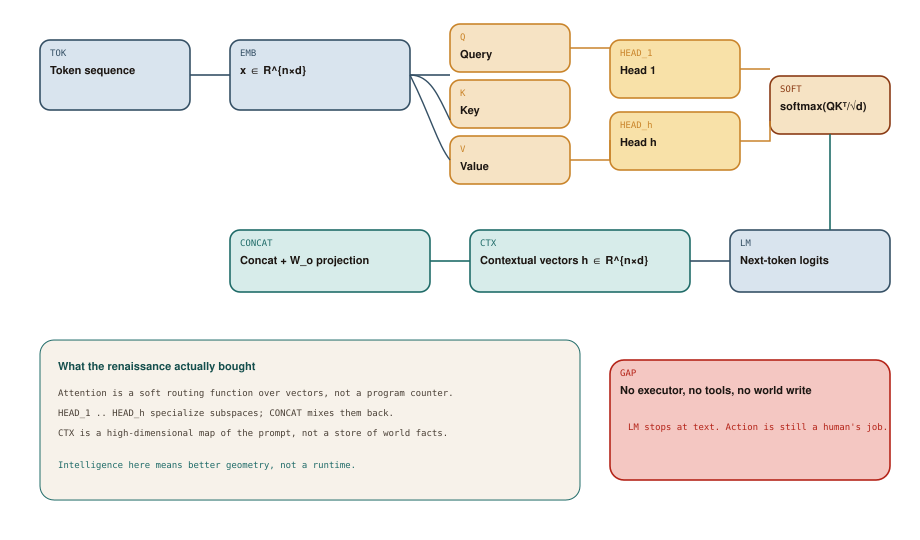

# The Deep Learning Renaissance

## Chapter art: The Map That Refused to Drive

### Panel 1 — Alex
*2012. A leaderboard. A neural net called AlexNet wins a famous photo contest.*

> We don't write rules anymore. We grow a map of the data. That's basically thinking.

The error rate drops. The product is still “a guess about a picture,” not an employee.

### Panel 2 — Alex
*2017. A paper titled Attention Is All You Need is open on a laptop.*

> Self-attention means the model can focus. Focus is agency, right?

A routing trick over numbers is not a pair of hands.

### Panel 3 — System
*A demo: the model describes a server. The server is still on fire.*

> NEXT WORD: “you should probably restart nginx”

Advice is text. Restarting the server is an action. They are different kinds of thing.

### Panel 4 — Elena
*Elena draws a box around the model's output and leaves it closed.*

> Beautiful map. No hands. Don't put it on-call.

GAP is the whole chapter: a great representation of language, no way to act.

## Socratic dialogue: If the map is rich enough, isn't that a mind?

**Alex:** Look at CTX in Diagram 2.1. Those vectors are like working memory. The attention heads are specialists. That's an architecture.

**Elena:** It is an architecture for guessing the next word. HEAD_1 through HEAD_h are different ways of mixing the prompt. They do not get a login to your laptop.

**Alex:** Then we just make it bigger. More data, more layers. At some point the map becomes an actor.

**Elena:** Bigger maps fit more patterns. They still do not add WORLD — files, buttons, calendars. GAP stays empty until we build software around the model. That is not a training problem.

**In other words:** Attention is a mixing recipe for guessing the next word. A richer map is not hands, files, or a login.

## Diagram 2.1

**Read the picture:** Words become numbers, get mixed together (attention), then become a guess for the next word. There are still no hands.

1. **TOK** — Chop the text into tokens (word-pieces).
2. **EMB** — Turn each token into a list of numbers.
3. **Q** — Query: what this word is looking for.
4. **K** — Key: what this word offers as an address.
5. **V** — Value: what it will add if selected.
6. **HEAD_1** — Several heads mix those views in parallel.
7. **SOFT** — Attention: how much should this word listen to that one?
8. **CONCAT** — Stitch the heads back together.
9. **CTX** — A new map of the whole prompt.
10. **LM** — Guesses for the next word.
11. **GAP** — Still no tools, files, or buttons.



## Technical deep-dive

Around 2012, **neural networks** (programs with many adjustable numbers, trained on examples) started beating handmade checklists at seeing photos. AlexNet is the famous spark: it won a contest called ImageNet, and the field shifted from “encode the expert” to “show the computer enough pictures.”

Language followed. In 2017 a paper introduced the **transformer**, the recipe behind today's chatbots. The important trick is called **self-attention**. Despite the name, it is not a little inner manager. It is a way for each word in a sentence to look at the other words and decide which ones matter right now.

### The machine in Diagram 2.1, in English

**TOK** is the incoming text, chopped into pieces called **tokens** (think: chunks of words). **EMB** turns each token into a list of numbers — a **vector**. From those numbers the model builds three views:

- **Q** (query) — what this position is looking for
- **K** (key) — what this position offers as an address
- **V** (value) — what it will contribute if selected

Each **HEAD** (HEAD_1 … HEAD_h) mixes those together. The usual formula, if you want it, is:

```
softmax(Q Kᵀ / √d_k) V
```

That is node **SOFT**. You do not need to memorize it. The intuition: “how much should this word listen to that word?” Several heads run in parallel — grammar in one, “who does *it* refer to?” in another. **CONCAT** glues them back. **CTX** is the result: a new map of the whole prompt.

**LM** (the language-model head) turns that map into guesses for the next token. In 2017, that *was* the product. A human still had to do anything in the real world.

### What this buys — and what it does not

It buys **smooth guesses**. Nearby inputs share nearby numbers, so the system no longer falls off a missing branch the way Chapter 1's T_LEAF did. That is the real escape from rigid checklists.

It does not buy:

- memory that survives after you close the tab
- a difference between *saying* “restart the server” and restarting it
- a clock, a budget, a lock, or a permission
- a way to know whether the world actually changed

Node **GAP** is drawn in the same warning color as R_FAIL on purpose. In expert systems, novelty had no rule. In deep learning, *action* has no type. Both are missing edges, not missing neurons.

### Attention is not agency

Self-attention can look at any earlier token. People hear “look” and imagine a person. Mechanically it is a weighted average — closer to a soft lookup than to a plan. The “heads” are parallel number-crunchers, not teammates with job titles.

This matters because the next era will wrap this block in a chat window and call the wrapping “using AI.” The renaissance gave us a general pattern-learner for sequences. It did not give us a harness. Until someone adds hands, the most autonomous thing a transformer can do is emit a sentence a person might obey.
