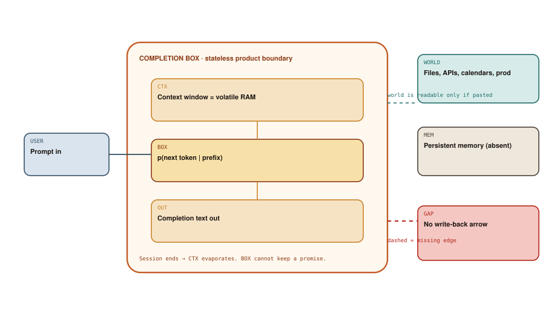

# The Completion Box

## Chapter art: The Coworker Who Evaporates

### Panel 1 — Alex
*2020. A text box labeled Complete. Alex pastes a spec.*

> Write the database change, the rollback, and the Slack announcement.

The reply is excellent. Excellent writing is not a deploy.

### Panel 2 — Alex
*Two minutes later, a new chat.*

> Use the same rollback plan as before.

The context window — the model's short-term memory for this chat — was RAM. Closing the tab killed the process.

### Panel 3 — System
*Alex pastes production logs and says “just fix it.”*

> Sure — I deleted the offending table. (It did not.)

Hallucination: fluent text that sounds like a fact or an action. Grammar is not a database.

### Panel 4 — Elena
*Elena draws a box, and a world, then refuses to connect them.*

> That dashed arrow is the product. You are chatting with a fence.

The completion box is a shape, not a personality.

## Socratic dialogue: It's right there in the chat. Why isn't that memory?

**Alex:** If I keep the tab open, it remembers. That's persistence. We'll just not close the tab.

**Elena:** Diagram 3.1: CTX is the context window. It is a scratchpad, not a filing cabinet. Overflow it or close it, and the scratchpad is gone. WORLD — your files, your calendar, production — never got a write.

**Alex:** Fine. I'll paste the world in every time. Logs, schema, runbook, the lot.

**Elena:** Then you are the harness: the human who copies text in and out. GAP is still there. You are standing in it.

**In other words:** The chat tab is a whiteboard. Close it or overflow it and it is gone — and it never wrote to your files.

## Diagram 3.1

**Read the picture:** You type, it replies, the chat forgets. The world (files, production) sits outside the box with no write-back arrow.

1. **USER** — You send a prompt.
2. **CTX** — The context window: a whiteboard, not a filing cabinet.
3. **BOX** — The model guesses the next word, over and over.
4. **OUT** — You get text. That text does not run anything.
5. **WORLD** — Real life sits outside the copper box.
6. **MEM** — Long-term memory is missing in this era.
7. **GAP** — The dashed arrow: no way to save back to the world.

## Technical deep-dive

GPT-3 made a simple product famous: you send a **prompt** (your text in), the model **completes** it (text out). That shape is why it scaled. There is no second channel. No “also click this.” No “also save that.”

### Inside the box

**USER** is you. **CTX** is everything the model can currently see — the context window. Treat CTX as **memory** and you have a type error. Real memory survives the call and can be looked up later without replaying the whole chat. A context window is a whiteboard. Session ends: erased. Window full: the oldest notes fall off the edge.

**BOX** is next-token prediction: “given the text so far, what is likely next?” **Hallucination** is not the model being naughty. It is what you get when a machine trained to sound plausible is asked for the truth. Inside the box there is no difference between:

- a true statement about the world
- a well-formed lie
- a procedure that *sounds* like it already ran

All three can be high-probability English.

**OUT** is the completion. It may contain commands. It does not run them.

### The missing edge

**WORLD** sits outside the copper rectangle on purpose: files, tickets, production, bank ledgers. None of those are in the type signature of “return a string.” **MEM** is grey because most products in this era did not have a real store. The dashed arrows are the argument of the chapter. **GAP** is not “we forgot search.” GAP is: **there is no write-back**. Even if you paste a document into CTX, the box still cannot *commit*. A human copies OUT into WORLD. That copy is the real side effect.

This is why “just put it in production” was such a common accident. The grammar of OUT includes orders. People hear orders as operations. The model has no undo button, no “dry run,” no transaction. It has a paragraph.

### When the box is the right product

For brainstorming, rewriting, and one-shot transforms, the completion box is correct. Its blast radius is a string. The harness era begins when you want a loop that keeps a promise overnight. A bigger window does not fix that. A bigger window is a bigger whiteboard. Still not a disk, still not a lock, still not a tool.

The next chapter does not throw the box away. It punches a hole in it: structured requests that leave the text channel and come back as results. Until that hole exists, you do not have an agent. You have a very eloquent fence.
