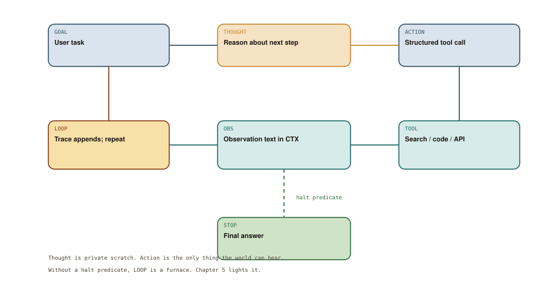

# The Emergence of Tool-Use

## Chapter art: I'll Go Look That Up (Narrator: It Did Not)

### Panel 1 — Alex
*A chat window. Alex needs a security bulletin and a patch.*

> Search the web, then open a pull request. You can do that — you're an assistant.

The model writes a search-shaped paragraph and a fake URL.

### Panel 2 — Elena
*Elena wires a real function call. JSON, not vibes.*

> If it cannot emit ACTION, it is still a completion box in a trench coat.

Tool-use begins when software can parse “I want to search” into an actual search.

### Panel 3 — System
*The tool returns an ugly error. The model flinches, then continues.*

> OBS: 429 too many requests. Retry-After: 30

Observation is how the world gets a vote.

### Panel 4 — Elena
*A loop on the whiteboard: Thought, Action, Observation.*

> Congratulations. You have a heartbeat. Now we argue about when it stops.

ReAct is a recipe, not a personality.

## Socratic dialogue: I described the tools in the system prompt. Isn't that function calling?

**Alex:** I told it the search API exists. It even writes little XML tags. That's tool-use.

**Elena:** That's fan fiction about a tool. Diagram 4.1 requires ACTION to be parsed and sent to TOOL. If nothing actually runs, you are still in Chapter 3.

**Alex:** Okay, so we let it call everything. Search, shell, payments, whatever. Maximum agency.

**Elena:** Agency without a stop rule is Chapter 5. Learn the loop first: THOUGHT is private scratch, ACTION is the only thing the world can hear, OBS is the world's reply. Then we put a leash on LOOP.

**In other words:** Tool-use is only real when a program runs the request. Thinking about a tool is still Chapter 3.

## Diagram 4.1

**Read the picture:** Think, then call a real tool, then read the result. Repeat until a stop rule fires.

1. **GOAL** — The user asks for something.
2. **THOUGHT** — Private scratch — not checked by the world.
3. **ACTION** — A structured request a program can actually run.
4. **TOOL** — Search, code, an API — physics resumes.
5. **OBS** — The result comes back as text in the chat.
6. **LOOP** — Save the trace and go around again.
7. **STOP** — A real halt: step limit, final answer, or a human.

## Technical deep-dive

2023 is when the completion box grew a second kind of output. Besides ordinary sentences, models could emit a **structured request**: “call this function with these arguments.” Researchers named a simple loop **ReAct** — reason, then act. Other work (Toolformer, native function calling) taught models *when* to ask for a tool. The leap is not “the model got better at APIs.” It is that **text stopped being the only effect**.

### The loop, node by node

**GOAL** is the user's task. **THOUGHT** is the model talking to itself. Useful as a scratchpad; dangerous as a source of truth, because thoughts are not checked by the world.

**ACTION** is the hole in the fence: a typed request a host program can parse. If policy allows, the host runs **TOOL** — search, a database, a browser, a compiler. Tools can fail, be slow, or return a confident wrong answer of their own.

**OBS** (observation) is that result, turned back into text and stuffed into CTX. The model does not “see the website.” It sees a string the harness chose to show it.

**LOOP** appends the triple (thought, action, observation) and repeats. **STOP** is not a vibe of “I feel done.” It is a rule: a step limit, a “final answer” action, or a human clicking halt.

### Describing a tool is not providing a tool

A prompt that says “you can search” makes search-*shaped sentences* more likely. It does not plug in a network cable. Easy test: unplug TOOL. If the model still says “I searched and found…”, you never left the completion box.

A minimum real setup already includes boring software:

| Concern | Naive prompt | Actual ACTION channel |
| --- | --- | --- |
| Shape of the request | “pass a query” | A schema: names and types for arguments |
| Secrets | “use the API” | Keys never pasted into the chat |
| Errors | “try again” | OBS contains the error |
| Side effects | “be careful” | Allowlists, dry-runs, don't repeat dangerous calls |
| Halt | “stop when done” | Max steps, timeouts |

### The new failure mode

Once ACTION exists, the model can be wrong *in the world*, not just on the page. A bad search wastes time. A bad delete is a different species. Chapter 4's gift is a heartbeat. Chapter 5's crime is leaving the heartbeat on the table with no budget. The ReAct loop is the right primitive. Unbounded, it is a furnace.
