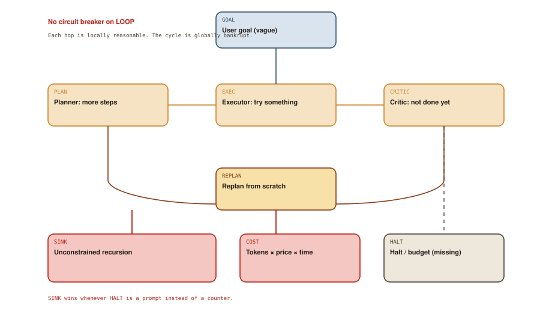

# Early Agentic Frameworks

## Chapter art: Let It Cook

### Panel 1 — Alex
*Friday 6:12 p.m. Alex starts an “autonomous agent” and a dream.*

> Goal: make the product better. I'll check in the morning.

A vague GOAL is gasoline. A missing HALT is the match.

### Panel 2 — System
*3:00 a.m. The planner writes a plan to write a better plan.*

> CRITIC: progress insufficient. REPLAN.

Each hop sounds earnest. The cycle is a drain.

### Panel 3 — Alex
*Morning. Slack. Finance has entered the chat.*

> That's… a four-digit bill. Did it ship anything?

COST arrived. The code repository did not.

### Panel 4 — Elena
*Elena points at a dashed box labeled HALT.*

> You built a furnace and called it a coworker. Furnaces need thermostats.

Libraries made looping easy. They did not make stopping a real feature.

## Socratic dialogue: If we give it more roles, won't it self-correct?

**Alex:** Planner, executor, critic, researcher, intern. They keep each other honest. It's like a team.

**Elena:** Look at Diagram 5.1. PLAN, EXEC, and CRITIC form a loop whose natural resting place is SINK, not STOP. A critic that always wants “one more pass” is a heater.

**Alex:** Then we prompt the critic to be decisive. “Stop if good enough.”

**Elena:** If HALT lives in a prompt, it is a suggestion. If HALT lives in the host as a step counter, a clock, and a spend cap, it is a circuit breaker. Guess which one Finance believes.

**In other words:** Extra roles without a stop switch become a heater. The off button has to live in code, not in a pep talk.

## Diagram 5.1

**Read the picture:** Planner, doer, and critic keep handing work back. With no stop button, the loop burns money.

1. **GOAL** — A vague wish: “make it better.”
2. **PLAN** — The planner adds more steps — including planning to plan.
3. **EXEC** — The executor tries something, or looks busy.
4. **CRITIC** — The critic says “not done.” That is a heater.
5. **REPLAN** — Throw away the trace and start over.
6. **SINK** — The cycle with no off switch.
7. **COST** — Tokens × price × time. Finance notices first.
8. **HALT** — The missing box: a budget in code, not in a prompt.

## Technical deep-dive

Once the thought–action–observation loop existed, the obvious product move was to **put the loop in a library** and let people stack “roles.” LangChain made chains (and later agents) easy to wire. AutoGPT showed a goal-conditioned loop you could leave running. CrewAI and friends made “teams of AIs” something you could import. The boom was real, useful, and full of footguns.

A **token** is a billing unit as well as a text chunk. More looping means more tokens means more money. That is not a side issue. That is the plot of this chapter.

### The recursion sink

Diagram 5.1 is a machine with a missing “off” state.

1. **GOAL** arrives vague (“make the product better”).
2. **PLAN** expands it into steps, including steps like “research how to plan.”
3. **EXEC** tries a tool call — or a no-op that looks busy.
4. **CRITIC** compares the world to a fuzzy rubric and, being a completion box, prefers more language.
5. **REPLAN** throws away half the trace and starts again, often with no durable notebook.

Nothing in that cycle counts down a budget. **SINK** is unconstrained recursion: each step is locally reasonable, globally endless. **COST** is the only honest metric this era reliably produced. **HALT** is grey because most tutorials left it as English.

In the wild, runaway traces looked like:

- repeated “I will now…” thoughts with no ACTION
- tool thrash (search, click, search the same query)
- roles chatting with each other and never touching WORLD
- context bloat: the diary of the failure becoming the prompt for the next failure

### Brittle “memory”

Early frameworks often treated state as “the messages array” — the chat log. That is CTX from Chapter 3 wearing a class name. It drops. It duplicates. It cannot resume after a crash without doing side effects twice. Multi-agent variants made this worse: each role got a prompt, not a store, and “handoffs” were more completions.

A later harness will insist on:

- an explicit to-do list or state machine, not only a chat log
- tools that are safe to retry, with saved results
- checkpoints on disk
- **termination as code**, not as a vibe

### What to keep

Keep the idea that work splits into roles. Throw away the idea that roles *are* the control plane. PLAN/EXEC/CRITIC are prompting styles. The control plane is LOOP + HALT + COST, and it does not belong to the model.

The boom also created a second mess: every chat app invented its own dialect for tools. That is the next chapter. First, internalize the sink. If you cannot point to HALT in your picture, you do not have an agent. You have a bonfire with an API key.
