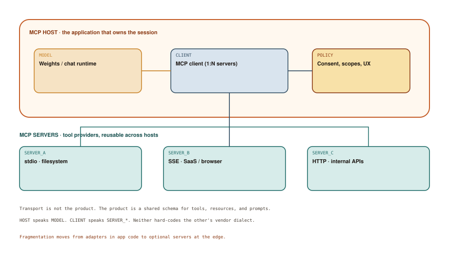

# Standardizing the Interop Layer

## Chapter art: Twelve Adapters, One Sad Intern

### Panel 1 — Alex
*A wall of YAML. Each vendor invented “tools” again.*

> I'll write a thin wrapper. It's just JSON.

It is never just JSON. It is login, streaming, schemas, and regret.

### Panel 2 — System
*The wrapper works in Chat App A. Chat App B wants XML tags and hope.*

> ERROR: unknown tool dialect 'functions.v3.beta'

The model is portable. The hands are not.

### Panel 3 — Elena
*Elena puts a protocol in the middle and takes a sip of tea.*

> Stop marrying the filesystem to the chat app. That's what SERVER_A is for.

A protocol is an agreed language so two programs can work together without dating.

### Panel 4 — Alex
*A single filesystem server plugs into three hosts.*

> Wait. I only had to implement the tool once?

That feeling is the whole point.

## Socratic dialogue: Isn't MCP just another acronym we have to learn?

**Alex:** We already have OpenAPI, plugins, function calling, custom tools in every framework. One more name and I'm going back to regex.

**Elena:** Those are all shaped like one chat app. Diagram 6.1 splits HOST from SERVER. The filesystem does not care whether the model lives in a desktop app, an IDE, or a headless runner.

**Alex:** So the host still has to implement a client. That's an adapter.

**Elena:** One client per host, many servers for the industry. The old world was every host times every tool. You are arguing against division.

**In other words:** MCP is a shared plug: one client per chat app, many tool servers anyone can reuse.

## Diagram 6.1

**Read the picture:** The chat app owns the model. Tool servers plug in through one client — like USB-C for AI hands.

1. **MODEL** — The chatbot brain, inside the host app.
2. **CLIENT** — One adapter that talks to many tool servers.
3. **POLICY** — You still approve what the tools may do.
4. **SERVER_A** — A local tool (files on your machine).
5. **SERVER_B** — A remote tool (a website or SaaS).
6. **SERVER_C** — An internal company API.

## Technical deep-dive

Tool-use created a market. Markets without shared plugs create **adapter sludge**: intern-years spent mapping `parameters` to `arguments` to `input_schema`.

**MCP** (Model Context Protocol) is interesting because it **separates tool providers from chat apps**. Think USB-C: the cable is boring, the fact that many devices share it is not.

### The triangle, in English

- **HOST** is the application that owns the session: an IDE, a desktop agent, a chat product. It embeds **MODEL** and one **CLIENT**.
- **CLIENT** speaks MCP to many servers, and folds their tools, files, and prompt templates into CTX. It also surfaces **POLICY**: what the user consented to.
- **SERVER_A / SERVER_B / SERVER_C** are tool providers. Local (**stdio** — a program on your machine), remote (**SSE** or HTTP — a service on the network), or internal APIs. They do not contain a model.

The vertical arrow from CLIENT down to the servers is the plot. MODEL never hard-codes how to read a repo. HOST never has to vendor a one-off GitHub integration if a server already exists.

### What actually has to be shared

A protocol for agents is not only “call this function.”

| Surface | Why the host cannot fake it with a prompt |
| --- | --- |
| Tools | The ACTION channel from Chapter 4, with a schema |
| Resources | Handles to files or tickets without dumping the whole world into CTX |
| Prompts | Reusable instruction templates owned by the tool's domain |
| Transports | Local or remote, same messages |
| Capability negotiation | So hosts degrade instead of crash |

**POLICY** stays in the HOST on purpose. A filesystem server should not decide whether you meant to allow delete. Consent is an app problem. Execution is a server problem. Mixing them is how plugins become malware distribution.

### Politics after the plug

Protocols do not end arguments. They move them. Hosts can still compete on harness quality: how they summarize CTX, how they sandbox, how they break the loop. What they should *stop* competing on is the spelling of `read_file`. If your “agent platform” differentiator is a private tool dialect, you are selling lock-in as intelligence.

Chapter 7 takes the HOST seriously. MCP is the shared hands. A harness is the spine: memory, sandbox, brakes. You can have MCP and still light the Chapter 5 furnace. You cannot have a mature harness if every tool is a one-off dialect. Standardize the hands. Then engineer the spine.
