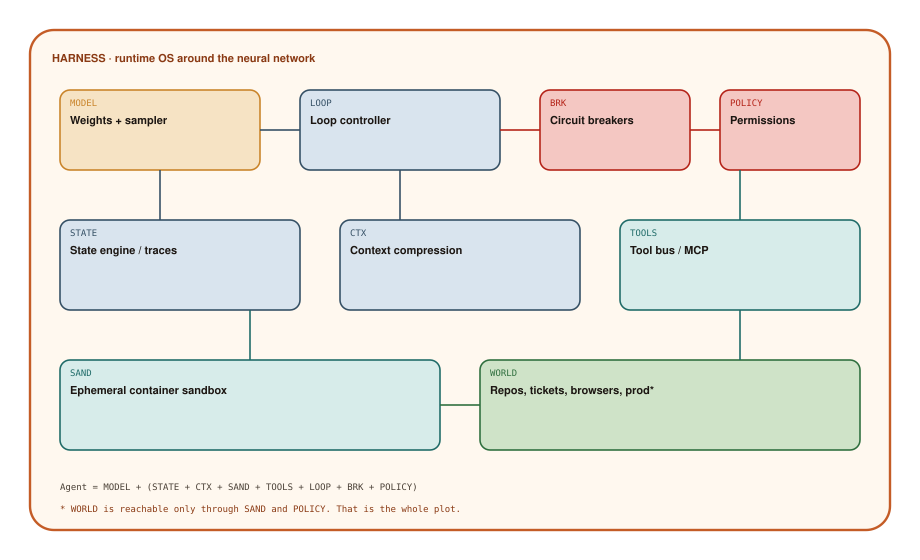

# What is an Agent Harness?

## Chapter art: A Racehorse Is Not a Logistics Company

### Panel 1 — Alex
*A beautiful model scorecard taped to a production dashboard.*

> The evals are state of the art. We'll just let it run in the repo.

SOTA (state of the art) is a property of MODEL. Production is a property of HARNESS.

### Panel 2 — System
*The model proposes a migration and also a poetry slam.*

> LOOP step 47: still “almost done”

Without BRK — brakes — “almost” is a forever state.

### Panel 3 — Elena
*A container starts, runs tests, dies. Elena smiles at the corpse.*

> Ephemeral SAND. If it lights on fire, the fire has a box around it.

A sandbox is a throwaway room. Distrusting the sampler is respect, not paranoia.

### Panel 4 — Elena
*The copper frame from the cover, drawn around the model.*

> That frame is the product. The horse is a component.

Agent = Model + Harness. Say it until design reviews get shorter.

## Socratic dialogue: Can't the model just be the operating system?

**Alex:** If CTX is RAM and tools are system calls, the model is already the kernel. We should keep the host thin.

**Elena:** Real kernels are strict about isolation. Samplers are not. Diagram 7.1 puts LOOP, BRK, POLICY, and SAND around MODEL because those have to stay true even when the next sentence is whimsical.

**Alex:** Thin host, fat prompt: we instruct it to persist state and to stop. That's an OS in English.

**Elena:** English is not a container. STATE has to survive a crash. BRK has to fire when MODEL would like one more step. If it is in the prompt, it is optional. Optional brakes are decoration.

**In other words:** The model is the brain. The harness is the rest: memory, tools, a sandbox, and brakes that still work when the model wants one more step.

## Diagram 7.1

**Read the picture:** The model is one box. The copper frame is the harness: memory, tools, a sandbox, and brakes.

1. **MODEL** — The brain. Allowed to be chancy.
2. **LOOP** — The scheduler: next step, retry, cancel.
3. **BRK** — Brakes: max steps, max spend, max time.
4. **POLICY** — Permissions: which tools and secrets.
5. **STATE** — Durable notes that survive a crash.
6. **CTX** — What we actually show the model (a small whiteboard).
7. **TOOLS** — The plug for hands (ideally MCP).
8. **SAND** — A throwaway room so fires stay boxed.
9. **WORLD** — Production, repos, browsers — only through the sandbox.

## Technical deep-dive

A **harness** is the software around a model that remains correct even when the model is only *probably* right. It is not a system prompt, not a brand name, and not “agents” as a slide title.

The thesis of the book is the equation on the cover:

**Agent = MODEL + HARNESS**

In Diagram 7.1 the copper rectangle is the harness: **LOOP + BRK + POLICY + STATE + CTX + TOOLS + SAND**, with **WORLD** reachable only through the last pair.

### Control: who gets to continue?

**MODEL** is the trained network plus a sampler (the bit that picks the next token). It is allowed to be chancy. That is its job.

**LOOP** is the scheduler from Chapter 4, promoted to real software: step numbers, retries, cancel. It may *ask* the model what to do next. It does not *ask permission* to stop.

**BRK** are circuit breakers: max steps, max wall-clock time, max spend, max errors in a row, blast-radius limits (“only one production change per task”). Boring on purpose. Boring is how you still have a company after a weekend run.

**POLICY** is identity and permission: which tools, which repos, which secrets. POLICY must be evaluated *outside* the model. A model that “promises to be careful” is not an access-control system.

### Memory: what survives a crash?

**STATE** is durable: task records, traces, checkpoints, saved files. If the process dies, STATE is how you do not charge a customer twice or merge a branch twice.

**CTX** is the pipeline that *projects* STATE onto the tiny whiteboard the model can see. Summaries, snippets, pinned contracts. Context engineering is harness work: what to show, what to hide (secrets), what to drop. A bigger window delays the problem. Compression is how you manage it.

### Hands: where physics resumes

**TOOLS** is the bus — ideally MCP from Chapter 6, not a drawer of one-off functions.

**SAND** is a throwaway room: a container, a virtual machine, a fresh browser profile. Network access is explicit. When the step ends, the room is demolished. Persistence happens because STATE chose to keep an artifact, not because a working folder lingered.

**WORLD** is everything you actually care about. The arrow from SAND to WORLD is the most dangerous line in the book. Production passwords in the same sandbox as model-authored shell is how “agent” becomes “incident.”

### Why this is an OS, not a prompt

Operating systems exist because applications are not trusted with the raw machine. Models are applications with unusually fluent intent and unusually weak integrity. The harness is the kernel: isolation, scheduling, accounting, permissions. Swap MODEL for a stronger one and the agent should get better without rewriting POLICY. If swapping the model requires rewriting your safety story, you did not have a harness. You had a prompt with accessories.
