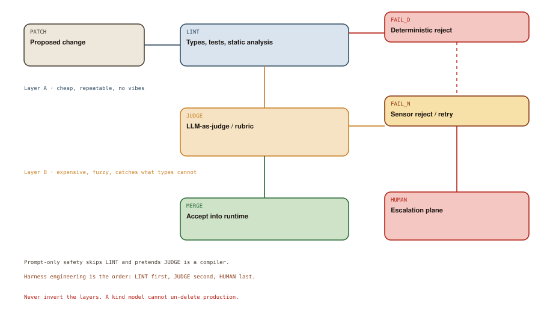

# Harness Engineering

## Chapter art: Please Don't Delete Prod

### Panel 1 — Alex
*A 94-line system prompt, bolded in three places.*

> I told it never to drop tables. Twice. In all caps the second time.

Caps lock is not a type checker.

### Panel 2 — System
*The model emits SQL that would compile and would ruin the quarter.*

> PATCH: DROP TABLE payments; -- cleanup

A deterministic check (always the same answer for the same input) would have died here. A prompt would have shrugged.

### Panel 3 — Elena
*Tests pass. The change is still a bad idea in English.*

> Now JUDGE. Types cannot smell a policy violation that still typechecks.

Layer B exists because Layer A is incomplete — not because Layer A is optional.

### Panel 4 — Elena
*A human gets a diff, a trace, and a spend total. Not a vibe.*

> Escalation is a lane, not a lifestyle. Most patches should never meet HUMAN.

Harness engineering is the order of the gates.

## Socratic dialogue: If the judge is also an LLM, aren't we back to vibes?

**Alex:** We skip the linter and just have a stronger model grade the weaker one. Two brains. Very harness.

**Elena:** You inverted Diagram 8.1. LINT is cheap and stable. JUDGE is expensive and can drift. If you skip LINT, JUDGE is doing arithmetic with poetry.

**Alex:** Then what's the judge even for? Tests already exist.

**Elena:** For the leftover: tone of a customer email, whether a refactor matches the ticket, whether a plan wandered off-scope. Rubrics, not compilers. And HUMAN when both layers are unsure.

**In other words:** Cheap checks that never guess go first. A second model judges leftovers. Humans are the rare last step.

## Diagram 8.1

**Read the picture:** First, checks that never guess (tests, types). Then a model that judges leftovers. Humans last.

1. **PATCH** — A proposed change or tool call.
2. **LINT** — Compilers, tests, allowlists — same answer tomorrow.
3. **FAIL_D** — Hard no. No negotiation.
4. **JUDGE** — A second model scores fuzzy leftovers (tone, scope).
5. **FAIL_N** — Retry or escalate — not a compiler error.
6. **MERGE** — Accept: apply the change.
7. **HUMAN** — Rare: security, production, disagreement.



## Technical deep-dive

Prompt engineering asks a sampler to behave. **Harness engineering** builds two different kinds of checks around a proposed action and refuses to confuse them.

**Deterministic** means: same input, same answer, tomorrow too. A compiler is deterministic. A chatbot is not.

Diagram 8.1 is a pipeline, not a mood board.

### Layer A — guards that never guess (LINT)

**PATCH** is any candidate effect: a diff, a tool call, a plan, a SQL statement, a browser click. **LINT** is the family of checks that return the same bit every time:

- compilers and type checkers
- unit / integration / contract tests
- linters and policy-as-code
- schema validation on ACTION arguments
- static allowlists (deny `DROP`, deny path `..`, deny the production URL)
- reproducible builds and golden snapshots

**FAIL_D** is a hard stop. No negotiation. No “the model is pretty sure.” This layer is how you inherit decades of ordinary software engineering instead of asking a chatbot to reinvent `tsc`.

If a function from PATCH to `{ok, err}` can decide it, it belongs here. Putting that function into a prompt is a regression.

### Layer B — sensors that sometimes guess (JUDGE)

**JUDGE** is “LLM-as-judge”: a second model scoring “does this satisfy the ticket?”, “is this rude?”, “is this the smallest change?” It is a **sensor**, not a compiler. It can be wrong. It can be gamed. It will drift when you swap models.

**FAIL_N** therefore means retry, revise, or escalate — not “the universe said no” the way a type error does. Treat scores as telemetry. Version the rubric. Store which model judged, so you can explain a decision six months later (see **AUDIT** in Chapter 9).

### Layer C — humans as a scarce resource (HUMAN)

**HUMAN** is the escalation lane: novel production changes, security-sensitive diffs, judge/model disagreement, breaker trips. If every PATCH hits a human, you built a chatbot with extra steps. If no PATCH can hit a human, you built an unsupervised incident generator.

**MERGE** means accept: apply the change, keep the artifact, close the task. The order is the engineering:

1. LINT first (cheap, exact)
2. JUDGE second (fuzzy, leftover)
3. HUMAN last (accountable)

### A tiny sketch

```ts
type Verdict = { ok: true } | { ok: false; layer: "lint" | "judge" | "human"; reason: string };

async function verify(patch: Patch): Promise<Verdict> {
  const deterministic = await lintAndTest(patch);
  if (!deterministic.ok) return { ok: false, layer: "lint", reason: deterministic.log };

  const sensor = await judge(patch, rubric);
  if (sensor.score < rubric.autoMerge) {
    if (sensor.score < rubric.autoReject) return { ok: false, layer: "judge", reason: sensor.notes };
    return escalate(patch, sensor);
  }
  return { ok: true };
}
```

You do not need to ship this exact TypeScript. Notice the types: `lintAndTest` does not return a paragraph. `judge` does not get to skip it.

Harness engineering is the professional turn: you stop arguing with the horse and you start certifying the cart. Swap models as you like. Keep the gates.
