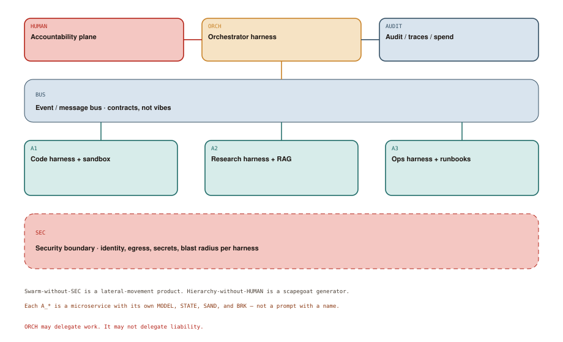

# The Future of Autonomous Systems

## Chapter art: Who Do We Page When the Swarm Is Sorry?

### Panel 1 — Alex
*A slide: 40 agents, one clip-art brain, no names.*

> We'll orchestrate a swarm. If one fails, another picks it up. Like Kubernetes, but genius.

Kubernetes has a control plane and an on-call rotation. Genius is not an SRE.

### Panel 2 — System
*Three specialists ship three overlapping refactors at 2 a.m.*

> MERGE CONFLICT in prod, identity: “the swarm”

A name that cannot be paged is not an owner.

### Panel 3 — Elena
*Elena draws SEC as a dashed red fence around each harness.*

> Lateral movement is a feature of your picture unless you make it a bug.

Many agents without isolation is a chatroom with credentials.

### Panel 4 — Elena
*A human, an audit log, an orchestrator. In that order of blame.*

> ORCH may delegate work. It may not delegate liability.

The last diagram is an org chart that happens to contain samplers.

## Socratic dialogue: If every specialist has a harness, isn't the orchestrator just another prompt?

**Alex:** ORCH can be a model that picks A1, A2, or A3. That's microservices. We already know this dance.

**Elena:** Microservices have contracts, identity, and blast radius. Diagram 9.1: BUS is typed events. SEC is a wall per harness. HUMAN sits above ORCH. A router-prompt with shared production credentials is a monolith that hallucinates.

**Alex:** We'll log everything. If something goes wrong, we read the traces.

**Elena:** AUDIT is necessary and not enough. Someone has to be pageable when A3 touches prod. If your answer is “the swarm,” you do not have a future. You have a memoir.

**In other words:** Work can be delegated. Blame cannot. Specialists sit behind a wall; a human stays pageable.

## Diagram 9.1

**Read the picture:** A human owns the blast radius. An orchestrator delegates. Specialists work behind a security wall.

1. **HUMAN** — Someone pageable. Work can be delegated; blame cannot.
2. **ORCH** — Routes tasks. Should not hold every production credential.
3. **AUDIT** — Who did what, which model, how much it cost.
4. **BUS** — A typed event bus — contracts, not vibes.
5. **A1** — A specialist: code in a sandbox.
6. **A2** — A specialist: research / retrieval.
7. **A3** — A specialist: ops / runbooks.
8. **SEC** — A wall per harness: identity, secrets, blast radius.

## Technical deep-dive

The endgame is not one giant model that “does the company.” It is **many small harnesses**, each with a job, talking over a bus, boxed by security, watched by audit, owned by a human. Diagram 9.1 is a sketch of that claim.

### Hierarchy, not hive

**HUMAN** is the accountability plane: a role, a rotation, a budget owner. It is drawn first because everything else is delegation of *work*, not of blame.

**ORCH** is an orchestrator harness. It may contain a model. It must contain LOOP, POLICY, and BRK of its own. Its tools are mostly “start a task on A1,” not “ssh to production.” If ORCH can do everything the specialists can do, you built a god-object with extra latency.

**AUDIT** records traces, tool calls, spend, model versions, judge scores, and who approved what. This is how you debug, bill, and testify. Sampling-based systems without audit are folklore.

**BUS** is how specialists communicate: events and contracts, not a shared 40,000-token “here's everything I thought.” Shared context windows across agents reintroduce Chapter 5's sink at org scale.

**A1 / A2 / A3** are specialist harnesses: code + sandbox, research + retrieval, ops + runbooks. Each is a Chapter 7 microservice: its own MODEL (possibly different), STATE, SAND, TOOLS, BRK. They are not personas in one prompt.

**SEC** is the dashed fence: identity per harness, secret scopes, who can talk to the internet, which data they may see. A research agent that can also `kubectl` is not “more autonomous.” It is a confused deputy.

### Safety is an operations problem

Safety here is not a model card. It is:

- **isolation** — SAND and SEC, so a jailbreak of A2 does not become credentials for A3
- **budgets** — BRK at ORCH and at each A_*, so cost cannot recurse through the bus
- **change management** — Chapter 8's dual-layer verify before anything crosses into WORLD
- **rollback** — STATE that can undo or freeze
- **ownership** — HUMAN that can disable ORCH without a standup

Multi-agent “frameworks” that skip these are theater. They will demo. They will also page you with a name that cannot answer the phone.

### What to build next

If you are shipping this:

1. Start with one specialist harness (Chapter 7) and dual-layer verify (Chapter 8).
2. Put tools behind a protocol (Chapter 6), not a private dialect.
3. Add ORCH only when a second specialist exists and the BUS contract is real.
4. Put HUMAN and AUDIT in the first design review, not the incident review.

Chapter 1 taught us frozen rules do not adapt. The chatbot era taught us fluent text is not an actuator. The homemade-agent boom taught us loops burn money. The harness era is the adult synthesis: **keep the sampler, wrap it in software you can stop, multiply that software only where isolation and ownership are real.**

An autonomous system is not a model that never asks. It is a runtime that can act, stop, prove what it did, and name the person who allowed the blast radius. The horse was always fast. The era is the harness.
